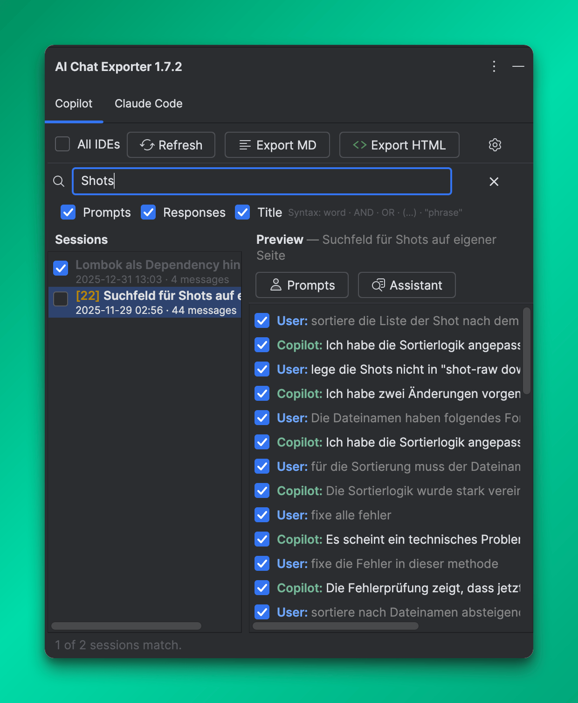
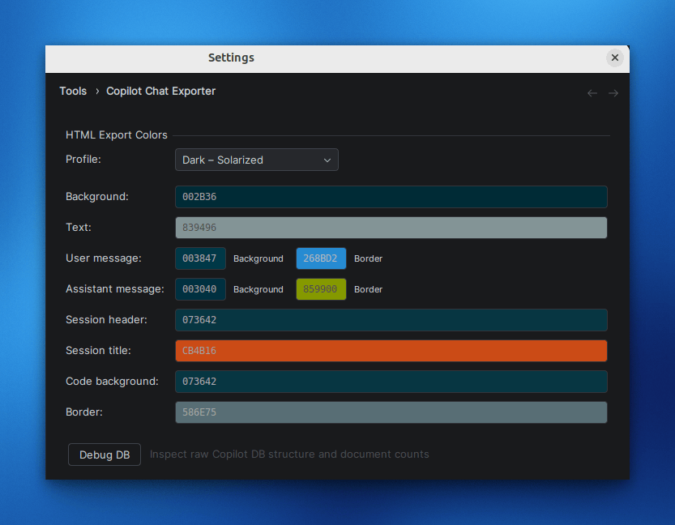

# Copilot Chat Exporter

> [Deutsche Version](README.de.md)

An IntelliJ plugin that lets you export your **GitHub Copilot chat history** to Markdown or styled HTML — directly from your IDE.

## Features

- **Browse all chat sessions** in a dedicated tool window, right inside your IDE
- **Select individual messages** per session for partial exports
- **Export to Markdown** (`.md`) — clean, portable, paste-ready
- **Export to HTML** (`.html`) — fully styled with syntax-highlighted code blocks, opens directly in the IDE after export
- **10 built-in color themes** for HTML output: Catppuccin Mocha, GitHub Dark, Dracula, Nord, Tokyo Night, One Dark, Monokai Pro, Material Ocean, Solarized Dark, Light Classic
- **Custom color profile** — configure all HTML colors individually via the settings page
- **Read-only access** — the Copilot chat database is never modified

## Settings

Open **Settings → Tools → Copilot Chat Exporter** to configure the HTML color profile. Choose from 10 presets or customize each color individually.

## Installation

1. Open your JetBrains IDE (IntelliJ IDEA, GoLand, PyCharm, etc.)
2. Go to **Settings → Plugins → Marketplace**
3. Search for **Copilot Chat Exporter** and install

Or install manually via **Settings → Plugins → Install Plugin from Disk** using the `.zip` from the [Releases](https://github.com/TomSchmidtDev/intellij-ai-chat-exporter/releases) page.

## Usage

1. Open the **Copilot Exporter** tool window (right sidebar)
2. Select the sessions you want to export using the checkboxes
3. Optionally select individual messages in the preview panel on the right
4. Click **Export MD** or **Export HTML** and choose a save location

## Requirements

- JetBrains IDE 2025.1 or later
- GitHub Copilot plugin installed and at least one chat session recorded

## Privacy

This plugin does not collect, transmit, or store any personal data. All operations are performed locally on your machine. No telemetry, analytics, or network requests are made.

## License

Business Source License 1.1 — free for personal, non-commercial, and internal business use. Converts to Apache 2.0 on 2031-04-04. See [LICENSE.md](LICENSE.md) for details.
